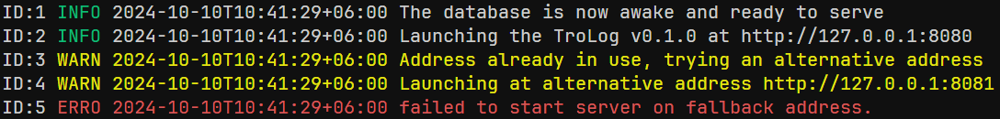

# TroLog

TroLog is a **structured logger** designed for high-performance applications written in Go. It provides **multi-level logging**, **thread-safe operations**, and customizable fields, making it an excellent choice for logging across distributed systems or standalone applications.



## Features

- **Multi-level logging** (Debug, Info, Warn, Error, Panic, Trace)
- **Thread-safe** and efficient logging mechanism
- **Support for structured fields** to enrich log data
- **Customizable output** to log files, stdout, and with optional color support for terminal outputs
- **Configurable log levels** for optimal verbosity control

## Installation

To install TroLog, use the following Go command:

```bash
go get -u github.com/mdtolhabinashraf/trolog
```

## Usage Example

### Simple Log Example

```bash
package main

import (
	"os"
	"github.com/mdtolhabinashraf/trolog"
)

func main() {
    // Initialize a new logger with the following options:
    // log level: "info", output: os.Stdout, colored output: true, logfile: ""
    trolog := trolog.NewLogger("info", os.Stdout, true, "")

    // Log an info-level message
    trolog.Info("hello world!")

    // Output format example:
    // ID:1 INFO 2024-10-10T10:24:44+06:00 hello world!
}
```

### Logger Configuration

- **Log level**: Set the minimum level of logs to be captured (e.g., "debug", "info", "warn", "error").
- **Output**: Specify the output destination (use `os.Stdout` for terminal output or provide a file path for log files).
- **Color**: Enable or disable color-coded logs for terminal output, which is useful for better readability.
- **Logfile**: If specified, logs will also be written to the file. Leave this option blank to skip writing logs to a file.
